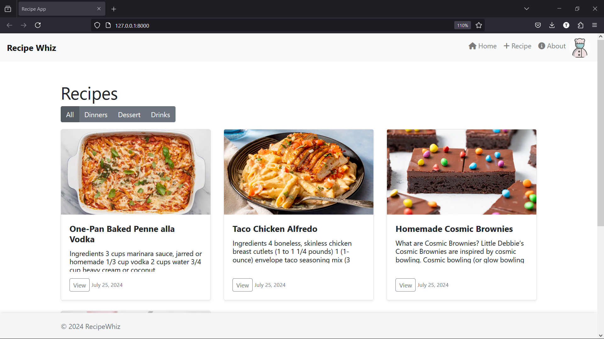
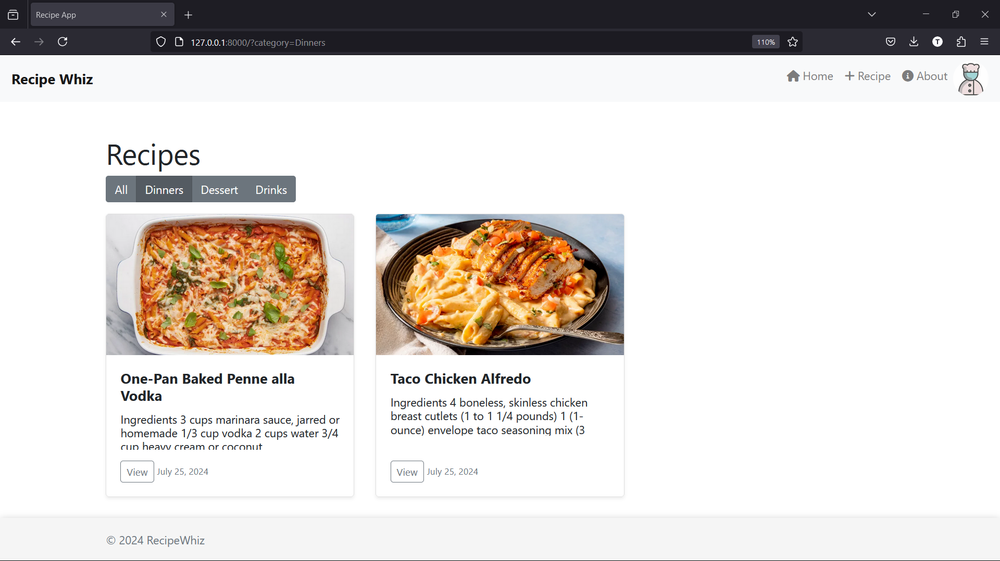
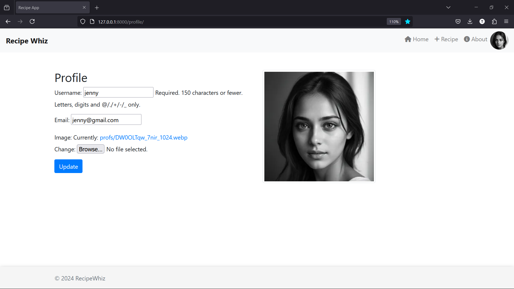
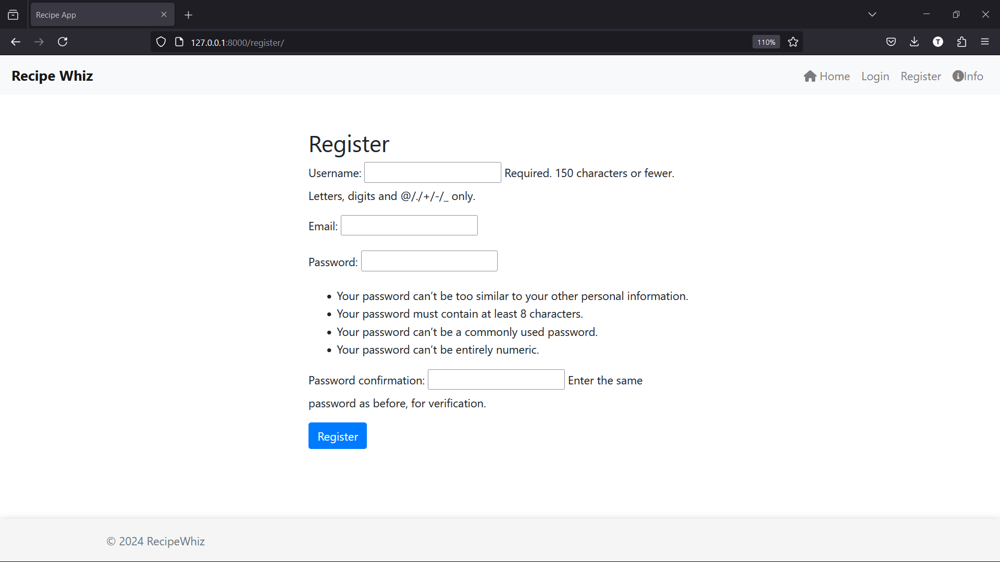
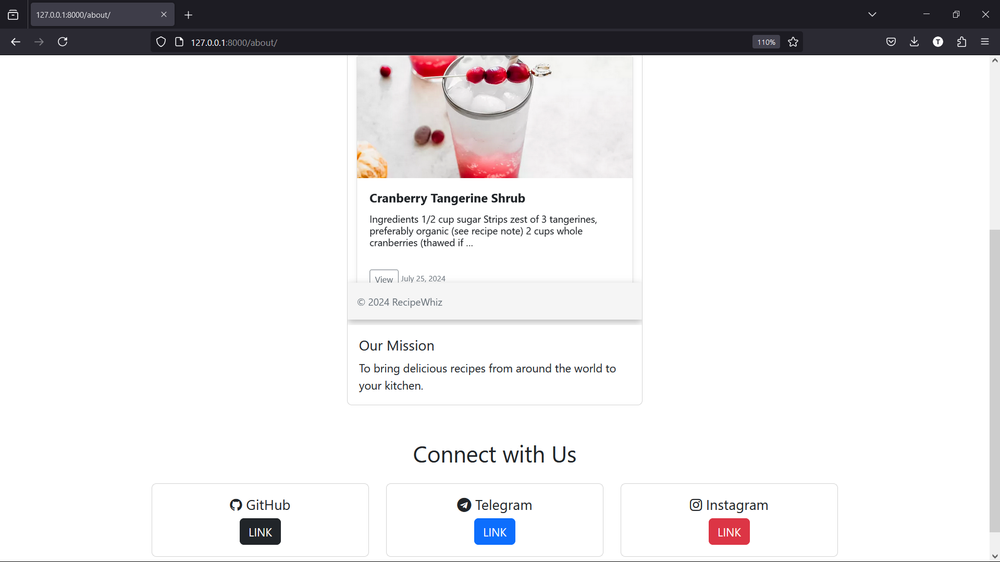

# Recipe Whiz Project

This is a recipe app project where users can browse, view, and create recipes. The project is built using Python Django with HTML, CSS, and Bootstrap.

## Features

- Browse recipes by category (Dinners, Desserts, Drinks)
- View detailed recipes with ingredients and instructions
- Create new recipes with image upload
- Add new categories for recipes
- Change profile photo
- User-friendly interface

## Technologies Used

- Python
- Django
- HTML
- CSS
- Bootstrap

## Additional Python Modules Required

- Pillow
- Django

## Installation

1. Clone the repository:
      git clone <repository-url>
   

2. Install the required Python modules:
      pip install -r requirements.txt
   

3. Run the Django server:
      python manage.py runserver
   

5. Access the recipe app at http://localhost:8000 or http://127.0.0.1:8000/

## Usage

1. Browse through the available recipes categorized as Dinners, Desserts, and Drinks.
2. Click on a recipe to view its details, including ingredients and instructions.
3. Create a new recipe by filling out the form and uploading an image.
4. Add new categories for recipes to better organize them.
5. Change your profile photo by navigating to the profile settings.

Feel free to customize the project to fit your needs and enjoy sharing and discovering recipes with Recipe Whiz!

# Screenshots : 

